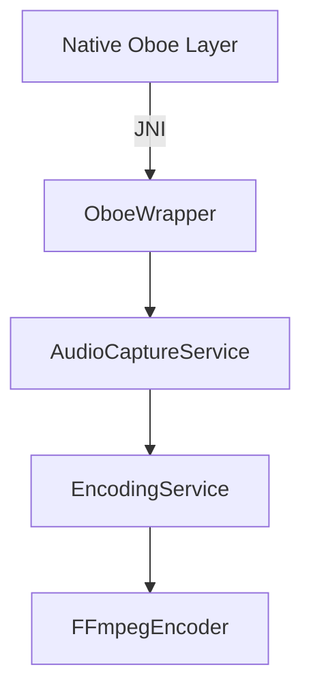

# Oboe Audio Integration Architecture

## System Overview


## 1. Component Architecture


## 2. Key Interfaces

### JNI Interface (native-lib.cpp)
```cpp
JNIEXPORT void JNICALL
Java_com_example_audiocapture_OboeWrapper_startCapture(
    JNIEnv* env,
    jobject obj,
    jint sampleRate,
    jint channelCount
) {
    // Oboe stream initialization
}

JNIEXPORT jobject JNICALL
Java_com_example_audiocapture_OboeWrapper_getAudioBuffer(
    JNIEnv* env,
    jobject obj
) {
    // Return direct ByteBuffer
}
```

### Kotlin Wrapper (OboeWrapper.kt)
```kotlin
class OboeWrapper : AudioSystem {
    private external fun nativeStartCapture(sampleRate: Int, channelCount: Int)
    private external fun nativeGetAudioBuffer(): ByteBuffer
    
    fun start() {
        try {
            nativeStartCapture(48000, 2)
        } catch (e: Exception) {
            fallbackToAudioRecord()
        }
    }
}
```

## 3. Data Flow Protocol
1. Native Oboe captures audio → fills direct ByteBuffer
2. JNI exposes buffer to Kotlin via `getAudioBuffer()`
3. AudioCaptureService processes buffer
4. EncodingService encodes via FFmpeg

## 4. Performance Targets
| Metric | Target | Measurement Method |
|--------|--------|---------------------|
| Latency | < 20ms | Oboe Performance Tuner |
| JNI Overhead | < 5% CPU | Android Profiler |
| Memory Stability | 0 leaks | Android Memory Monitor |

## 5. Risk Mitigation
- **JNI Stability**:
  - Global reference management
  - SIGSEGV handlers
  - Stress test with 72hr continuous capture
  
- **Fallback Mechanism**:
  ```kotlin
  private fun fallbackToAudioRecord() {
      Log.w("Oboe", "Falling back to AudioRecord")
      audioRecord = AudioRecord(...)
  }
  ```

## 6. Implementation Roadmap
1. Implement native Oboe capture (TDD: AudioEngineTests)
2. Build JNI bridge with buffer transfer
3. Integrate with AudioCaptureService
4. Adapt EncodingService for ByteBuffer input
5. Comprehensive device compatibility testing

## 7. Validation Criteria
- [ ] 50% latency reduction vs AudioRecord
- [ ] < 0.1% audio glitch occurrence
- [ ] 100% recovery from native crashes
- [ ] Consistent 48kHz/16-bit capture across devices

## 8. Documentation
- `docs/audio_architecture.md` - Full design spec
- `docs/jni_interface.adoc` - Native-Java contract
- `docs/performance_benchmarks.xlsx